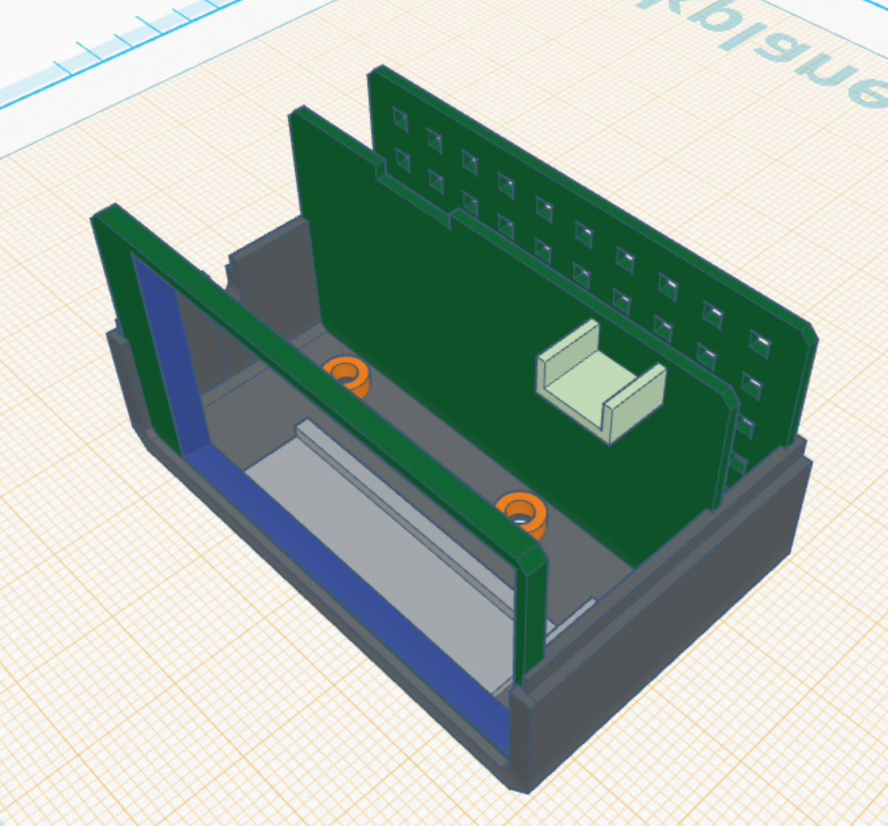

# 3D Case Model

THe project contains a 3D model for the case. You can find it inside [3d-case-model](../3d-case-model) in the root directory.

You might need to work with a file a little bit to adjust it, but it's good enough.

The case consists of 5 pieces: top, bottom, and 3 ribs. Assempled it should look similar to this:

The display and the button will be located in the front chamber, and the sensor in the back chamber (see the hole for wires in the middle rib).

If you open all the model files in a single workspace, you'll see how to compose them.
