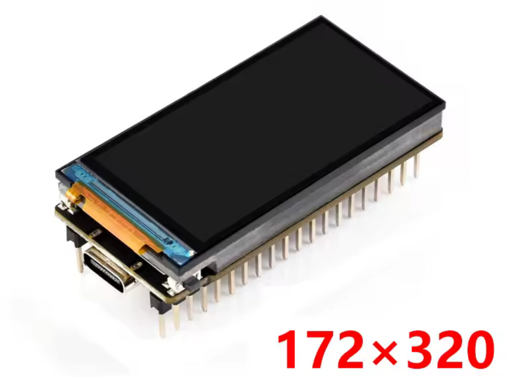
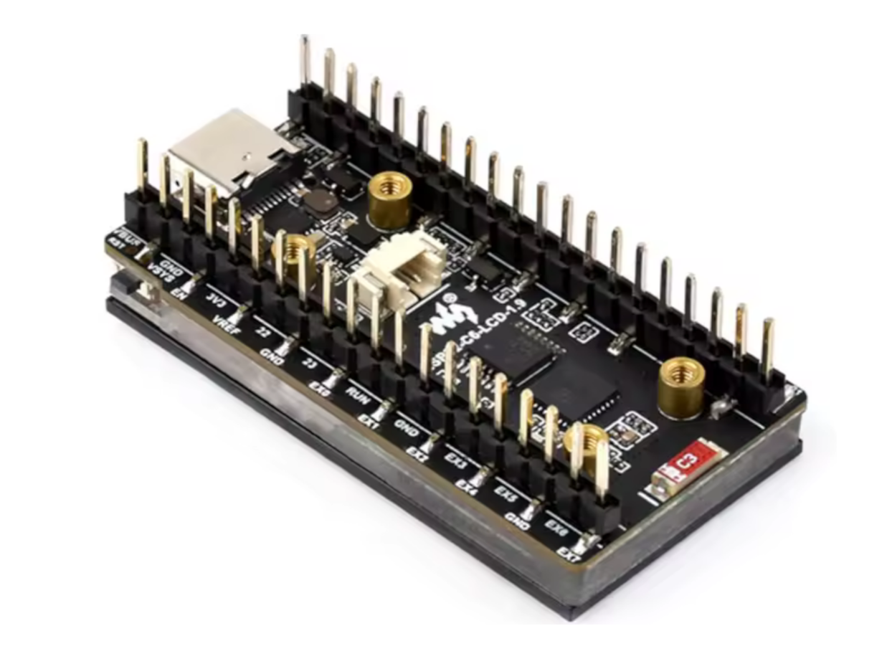
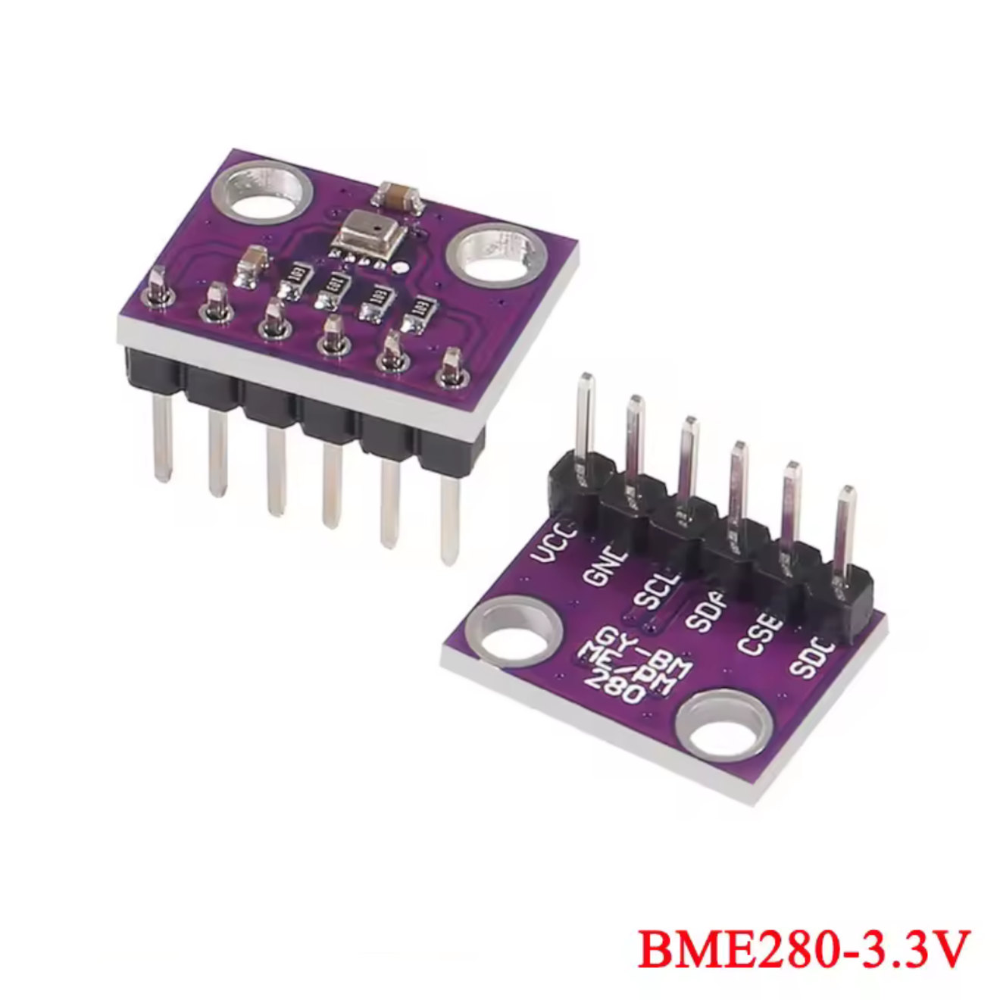
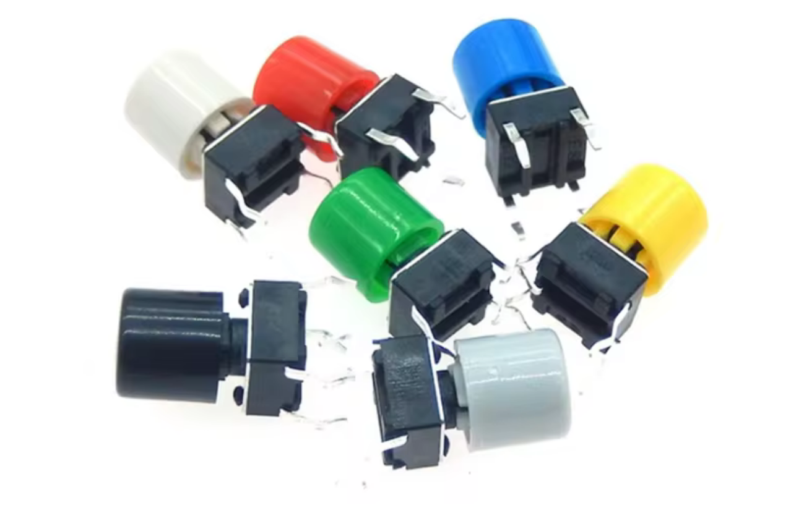

# Hardware

The device consists of ready-to-use components that you can buy and solder together (you need to solder 4 wires in total).

## ESP32-base display

I used some kind of a variation of the [Waveshare ESP32-S3-LCD-1.9](https://www.waveshare.com/wiki/ESP32-S3-LCD-1.9) display. There are multiple iterations of it.

It looks very similar the one on the official website (including the logo, and the measuremenets), but pin-out is sligtly different, so I add pinout screenshot here.
Anyway, if you buy the another iteration, you only need to make sure you use SPI pins to connect weather sensor. You can change IO constants at the top of `main/ui/display.cpp`.

Here how looks mine:

## Weather sensor

For weather sensor I used BME280 (note, not BMP280). It support measuring atmospheric pressure together with humidity and temperature.

The board connect to the sensor using SPI interface.

## The button

The button is a 6x6 button with 6mm cap. Obviously you can use any button, but 3d models for the case are designed for these types of buttons.

It looks very similar to this one:

## How do you soler it together

I'm not really good at soldering, so mine looks like the following:

