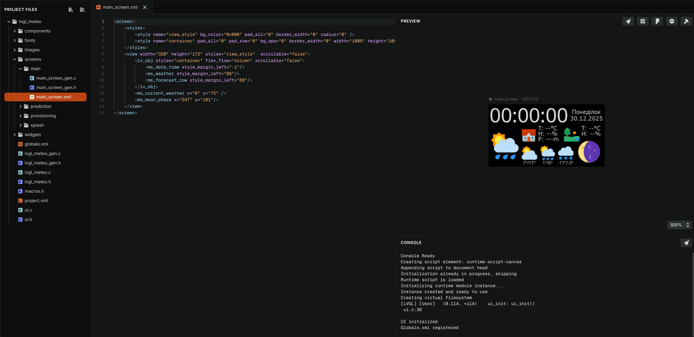

# UI

The project uses LVGL editor for UI. Opening `main/ui/lvgl_meteo` in the editor will give you a ready-to-use project that look like this:

You can find [official documentation](https://github.com/lvgl/lvgl_editor) in the editor repository.

There are some specifics in working with the Editor, but it's good enought. If you only need to adjust UI elements, there should be no problems with that.

If you use 172x320 display, you don't need to do anything at all.

Still, you might want to change splash screen image. It's located at `main/ui/lvgl_meteo/images/the_one_ring.png`. You can just replace the image, or use the editor to replace it together with the file name.
